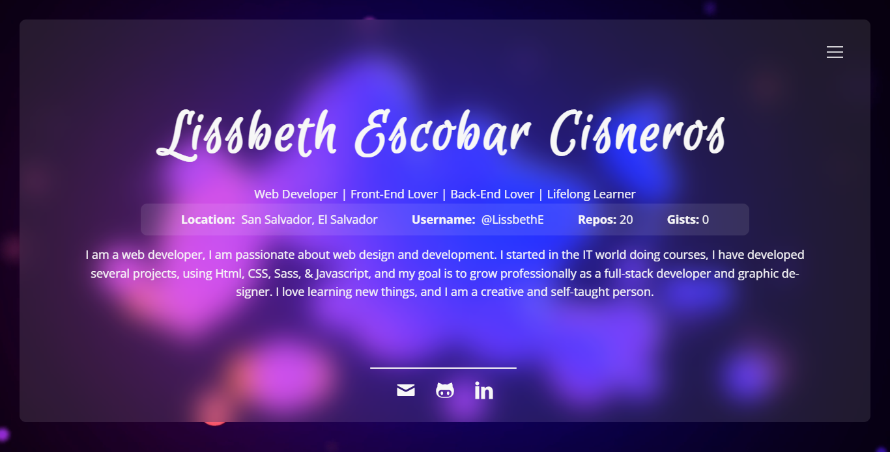

## ✨Project preview

<h1 align="center">✨ Display Projects</h1>

 

<h3 align="center">100% Responsive | Responsive For All Devices.</h3>
<h3 align="center">
  Build Using:
  
  
  
  
</h3>

 

  
   
  

 
 

The online site: <a href="https://lissbethe.github.io/DisplayProjects/" target="_blank">✨Display Projects</a>

 
